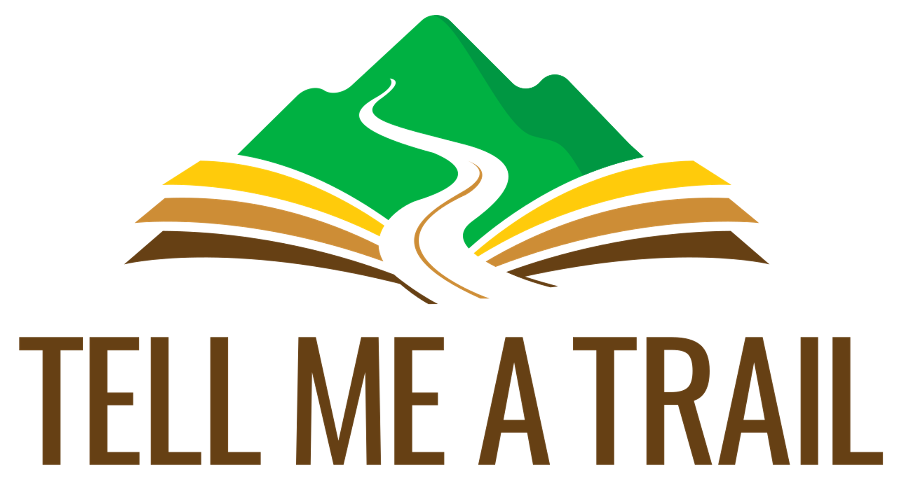
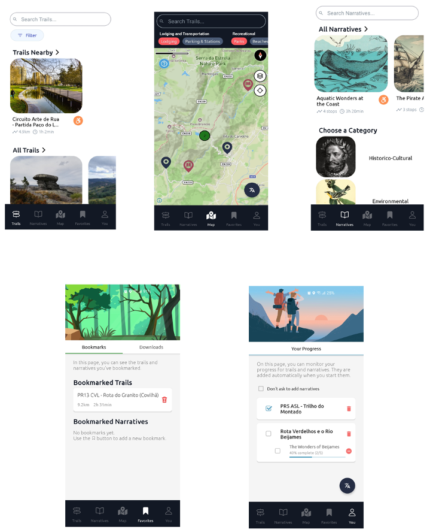
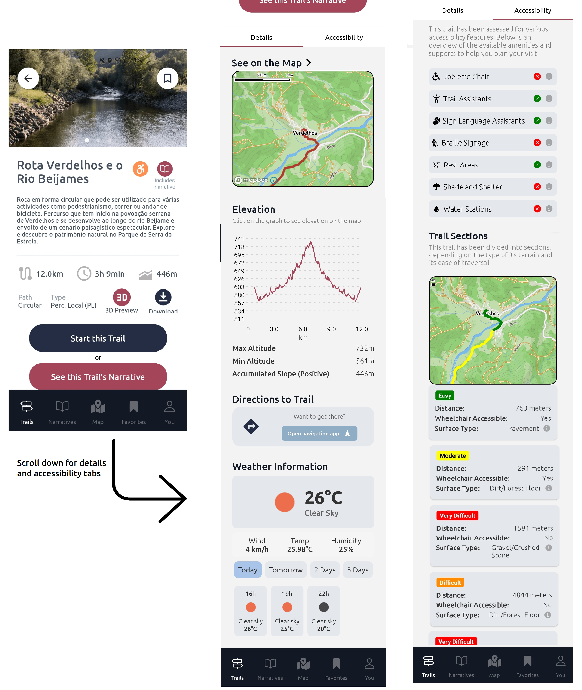
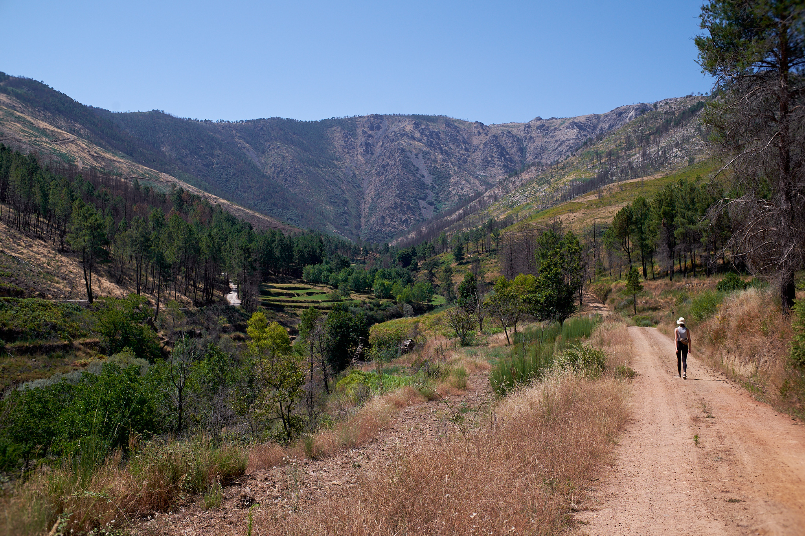

"**Tell-me a Trail**" is a mobile application that provides an improved tailored experience to walkers and hikers through interactive multimedia narratives. It is integrated in a Web architecture supported by [OGC standard](https://www.ogc.org/publications/) services.

## Screens

You can navigate and search for the trails according to three modes: 

- Trails nearby my position
- Trails on the map
- Search by narrative

Figure 1 - Main screens for the trails selection

Figure 2 - Navigation flow between screens 

Figure 3 - Screens for the trails details

## Case Study

The application has been tested by user with various profiles, with different trails in Portugal

But a main case study has been identified and will be used in further development of the app. It is located in the region of [Serra da Estrela](https://en.wikipedia.org/wiki/Serra_da_Estrela), Portugal. 

A trail called "**Verdelhos and Beijames river**" has been chosen to illustrate different types of narratives built around topics such as:

- Geology (The trail is integrated in the [Serra da Estrela GeoPark](https://www.geoparkestrela.pt/) ), 
- Wild Fires (The area has been battered with wild fires in the recent years), 
- Fauna and flora (the mountain biotope is unique in Portugal), 
- Local Economy and activities.

[Verdelhos wasteland is also the forest that feeds a community](https://www.publico.pt/2024/08/11/azul/noticia/portugal-baldio-verdelhos-floresta-alimenta-comunidade-2100313) (limited access).

> Input data, trails tracks and images were acquired by the authors and are available as open data.

### Trail track

- [Verdelhos-and-Rio -Beijames.kml](trail/Verdelhos-and-Rio-Beijames.kml)
- [Verdelhos-and-Rio -Beijames.gpx](trail/Verdelhos-and-Rio-Beijames.gpx)

### Media files

- [Verdelhos and Beijames river - natural and cultural heritage](narratives/heritage/)

